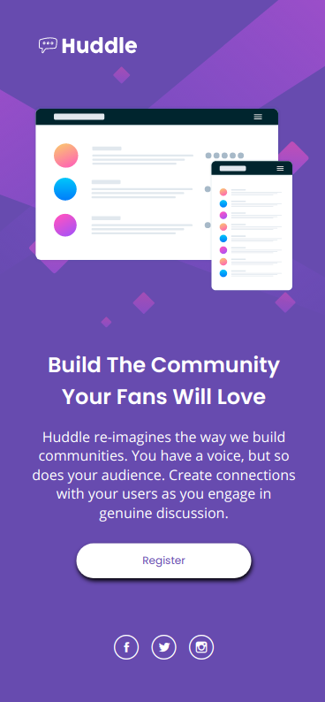

# Frontend Mentor - Huddle landing page with single introductory section solution

This is a solution to the [Huddle landing page with single introductory section challenge on Frontend Mentor](https://www.frontendmentor.io/challenges/huddle-landing-page-with-a-single-introductory-section-B_2Wvxgi0). Frontend Mentor challenges help you improve your coding skills by building realistic projects. 

[](https://app.netlify.com/sites/musing-pare-bfa0c7/deploys)

## Table of contents

- [Frontend Mentor - Huddle landing page with single introductory section solution](#frontend-mentor---huddle-landing-page-with-single-introductory-section-solution)
  - [Table of contents](#table-of-contents)
  - [Overview](#overview)
    - [The challenge](#the-challenge)
    - [Screenshot](#screenshot)
    - [Links](#links)
  - [My process](#my-process)
    - [Built with](#built-with)
    - [What I learned](#what-i-learned)
    - [Continued development](#continued-development)
    - [Useful resources](#useful-resources)
  - [Author](#author)

## Overview

### The challenge

Users should be able to:

- View the optimal layout for the page depending on their device's screen size
- See hover states for all interactive elements on the page

### Screenshot




Add a screenshot of your solution. The easiest way to do this is to use Firefox to view your project, right-click the page and select "Take a Screenshot". You can choose either a full-height screenshot or a cropped one based on how long the page is. If it's very long, it might be best to crop it.

Alternatively, you can use a tool like [FireShot](https://getfireshot.com/) to take the screenshot. FireShot has a free option, so you don't need to purchase it. 

Then crop/optimize/edit your image however you like, add it to your project, and update the file path in the image above.

**Note: Delete this note and the paragraphs above when you add your screenshot. If you prefer not to add a screenshot, feel free to remove this entire section.**

### Links

- Solution URL: [https://github.com/miguel-tostado/huddle-landing-page-with-single-introductory-section-master](https://github.com/miguel-tostado/huddle-landing-page-with-single-introductory-section-master)
- Live Site URL: [https://musing-pare-bfa0c7.netlify.app/](https://musing-pare-bfa0c7.netlify.app/)

## My process

### Built with

- Semantic HTML5 markup
- CSS custom properties
- Flexbox
- Mobile-first workflow


### What I learned

This project was super easy to get the 375px and 1440px versions completed; however, I chose to make this landing page more responsive for more screen sizes. This proved to be a bit more challenging as I had to make a few modifications with a lot of trial and error. In the end it came out very well so it was worth the time and effort!

This project helped to reinforce mobile-first and responsive development.

Go ahead and change your window size and see for yourself! :D

Definitely glad I found the below css to help with "fluid typography" in between the 375px and 1440px versions.

```css
  h1 {
    font-size: calc(24px + 16 * ((100vw - 375px) / 1065));
  }

  p {
    font-size: calc(16px + 2 * ((100vw - 375px) / 1065));
  }
```

### Continued development

I definitely need to continue improving my skills with making a website responsive. Getting better with flexbox, but I need to get back into grid at some point!

### Useful resources

- [Fluid Typography](https://css-tricks.com/snippets/css/fluid-typography/) - This helped with responsive font to improve responsiveness.


## Author

- Website - [Miguel Tostado](https://www.migueltostado.com/)
- Frontend Mentor - [@miguel-tostado](https://www.frontendmentor.io/profile/miguel-tostado)
- Twitter - [@207Toast](https://twitter.com/207Toast)